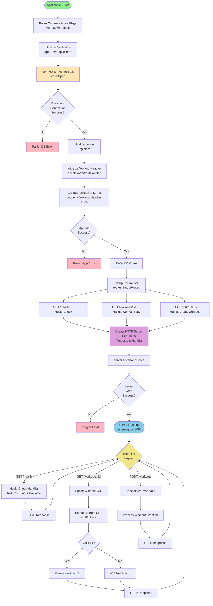

# Go Workout API Architecture

## Application Flow Diagram



## Project Structure

```
GoProject#4/
├── main.go                          # Entry point - server setup
├── go.mod                           # Dependencies
├── internal/
│   ├── app/
│   │   └── app.go                   # Application struct & initialization
│   ├── api/
│   │   └── workout_handler.go       # HTTP handlers for workouts
│   ├── routes/
│   │   └── routes.go                # Chi router configuration
│   └── store/
│       ├── database.go              # PostgreSQL connection
│       └── workout_store.go         # Database operations (empty)
└── tmp/
    └── main.exe~                    # Air build output
```

## API Endpoints

| Method | Path             | Handler             | Description           |
| ------ | ---------------- | ------------------- | --------------------- |
| GET    | `/health`        | HealthCheck         | Health check endpoint |
| GET    | `/workouts/{id}` | HandleWorkoutByID   | Get workout by ID     |
| POST   | `/workouts`      | HandleCreateWorkout | Create new workout    |

## Components

### 1. **Application** (`internal/app/app.go`)

- `Logger` - Logging to stdout
- `WorkoutHandler` - Request handlers
- `DB` - PostgreSQL connection

### 2. **Database** (`internal/store/database.go`)

- Driver: `pgx/v4/stdlib`
- Connection: `localhost:5432`
- Database: `postgres`

### 3. **Router** (`internal/routes/routes.go`)

- Framework: Chi router
- Routes: Health check & workout CRUD operations

### 4. **Handlers** (`internal/api/workout_handler.go`)

- Extract URL parameters with Chi
- Validate input
- Return appropriate HTTP responses
